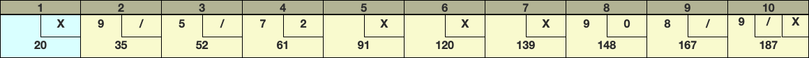

# Bowling Game Kata
The following is a TDD Kata, an exercise in coding, refactoring and **test-first**.

## Description
Create a program which, given a valid sequence of bowling rolls, produces the total score for the game.

The game consists of 10 frames. In each frame the player has two rolls to knock down 10 pins. The score for the frame is the total number of pins knocked down, plus bonuses for spares and strikes.

## Specification
Implement a solution with at least the following two methods:

* `roll(int)` is called each time the player rolls a ball. The argument is the number of pins knocked down (0 to 10);
* `getScore()` returns the total score for that game.

Before you start:
* Try not to read ahead, do one task at a time (the idea is to work incrementally);
* You may use whatever programming language you prefer;
* You should commit your code on GitHub or any other SCM repository you prefer. Best would be to simply fork this repository;
* Remember to refactor your code to improve modularity & readability.

### Step 1: return the score for a sequence of valid rolls (without bonus points for strikes and spares)
For example:
* The sequence of rolls 3 - 5 - 2 - 4 should return a total score of 14;
* The sequence of rolls 3 - 2 - 8 - 8 should throw an error (since you cannot knock down more than 10 pins in a single frame).

### Step 2: handle a spare with correct bonus
A spare is when the player knocks down all 10 pins in two rolls. The bonus for that frame is the number of pins knocked down by the next roll.

Consider the following scorecard (where "/" identifies a spare and "X" a strike):

In frame 2 above, the score is 10 (the total number of pins knocked down) plus a bonus of 5 (the number of pins knocked down on the next roll).

### Step 3: handle a strike with correct bonus
A strike is when the player knocks down all 10 pins on his first roll. The frame is then completed with a single roll. The bonus for that frame is the value of the next two rolls.

Consider the same scorecard above. In frame 1, the score is 10 (the total number of pins knocked down) plus a bonus of 10 (the number of pins knocked down on the next two rolls).

### Step 4: return the correct result for a game of 10 frames
In the tenth frame a player who rolls a spare or strike is allowed to roll the extra balls to get the bonus points. The tenth frame has two or three rolls; it's different from all the other frames.

Here are some examples (rolls in the tenth frame):
* The player rolls 5 - 2 and the game ends (5 - 2 => score is 7);
* The player makes a spare and one extra roll is allowed (8 - 2 - 3 => score is 13);
* The player makes a strike and two extra rolls are allowed (10 - 6 - 3 => score is 19). Keep in mind that the sequence 10 - 6 - 8 is not valid, unlike the sequence 10 - 10 - 5, because pins are not reset unless a strike is made. 

## General requirements
- **We would love to see your submission written in JavaScript**. Although, you can use whatever language and framework you want. Use something that you know well.
- **Provide a README with instructions** on how to compile and run the application.

**IMPORTANT:** Implement the requirements focusing on **writing the best code** you can produce. 

**CODE SUBMISSION:** Add the code to your own GitHub account and send us the link.

